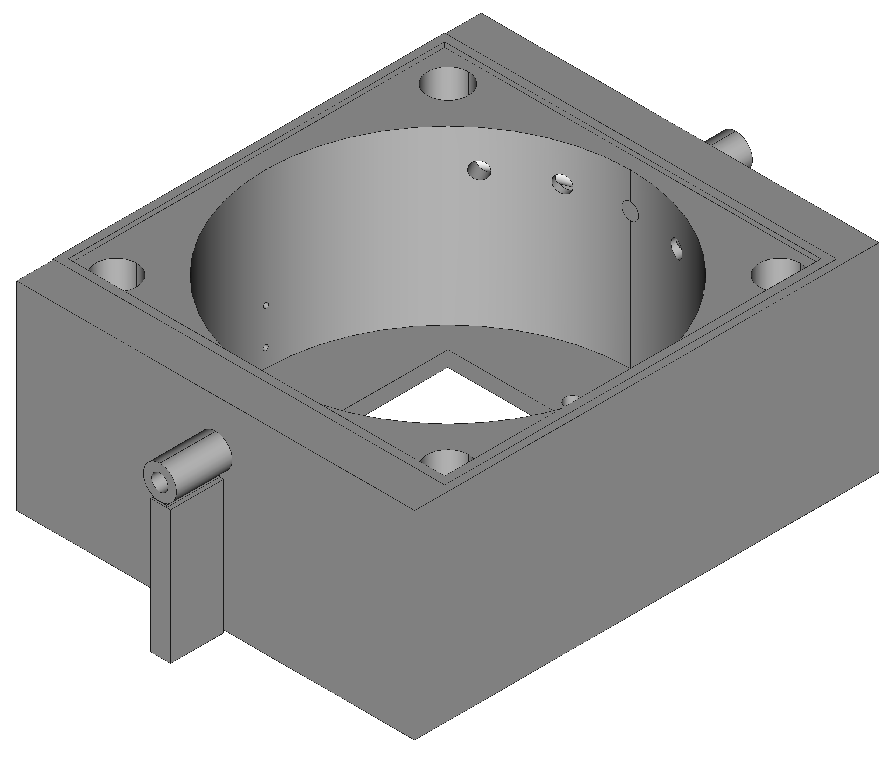
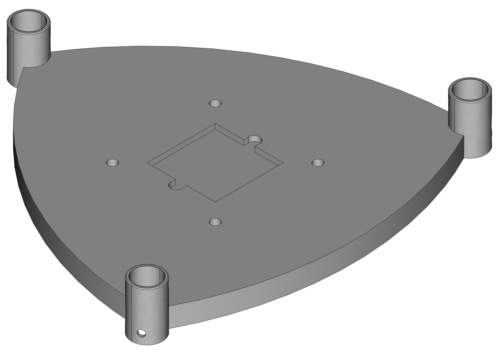
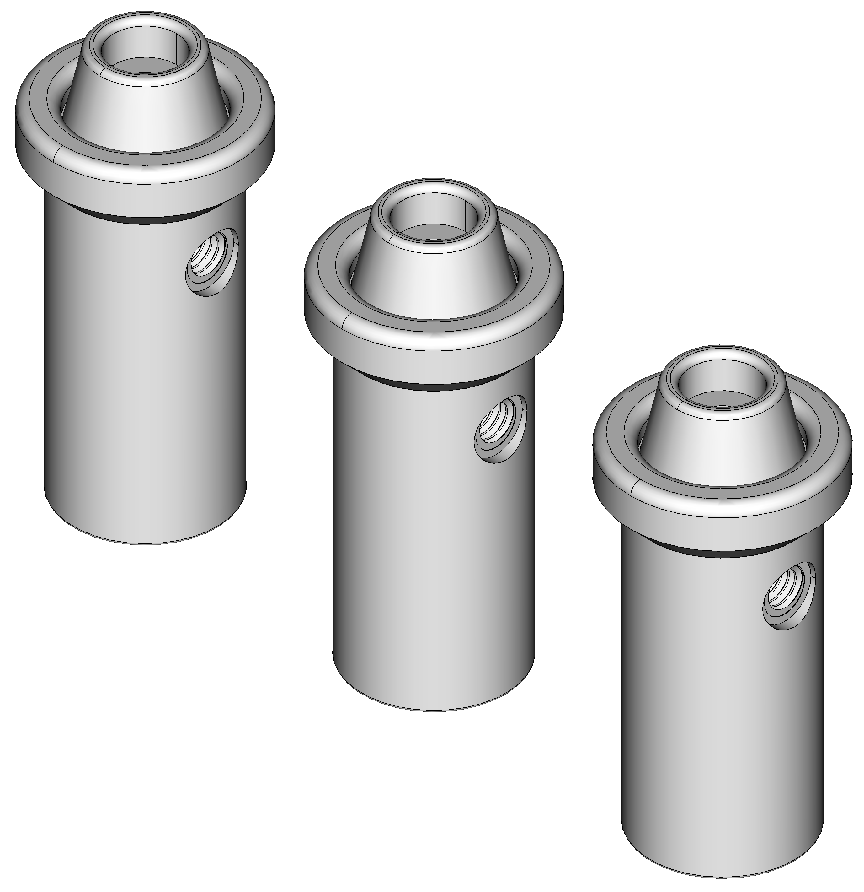
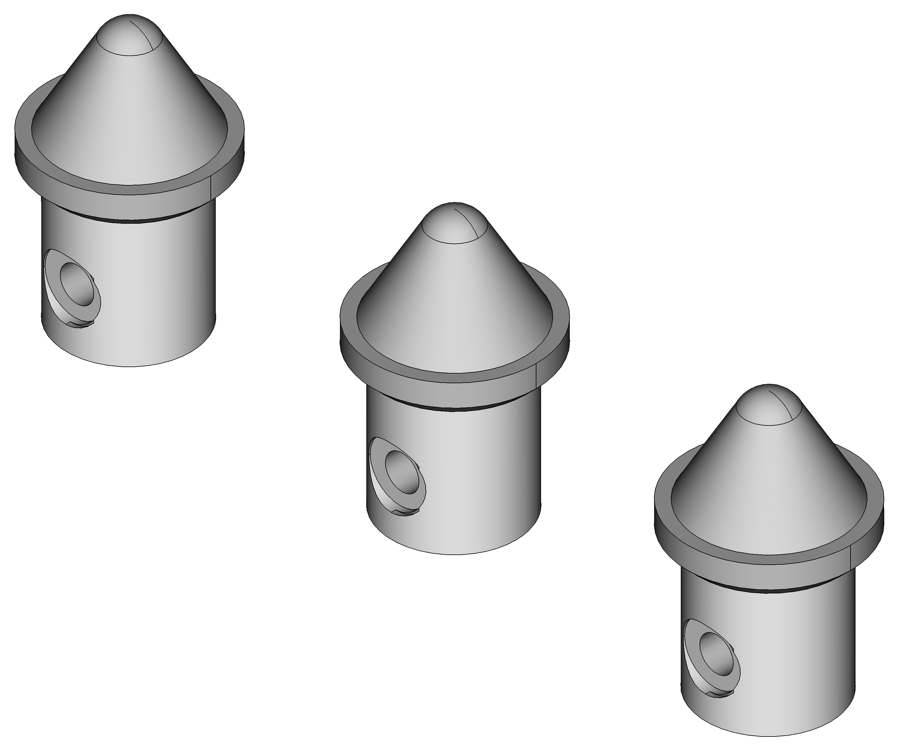
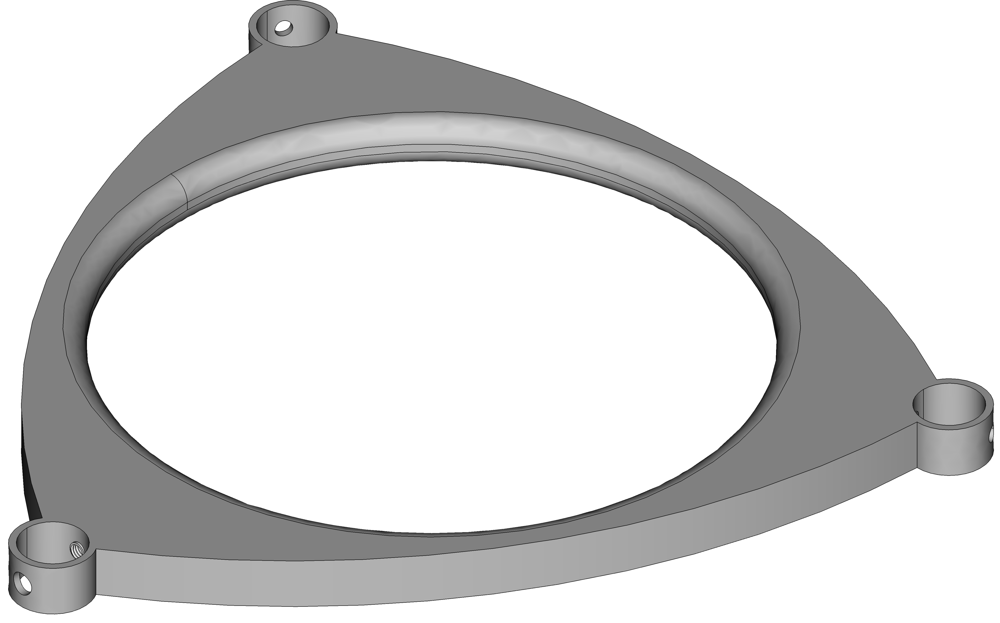
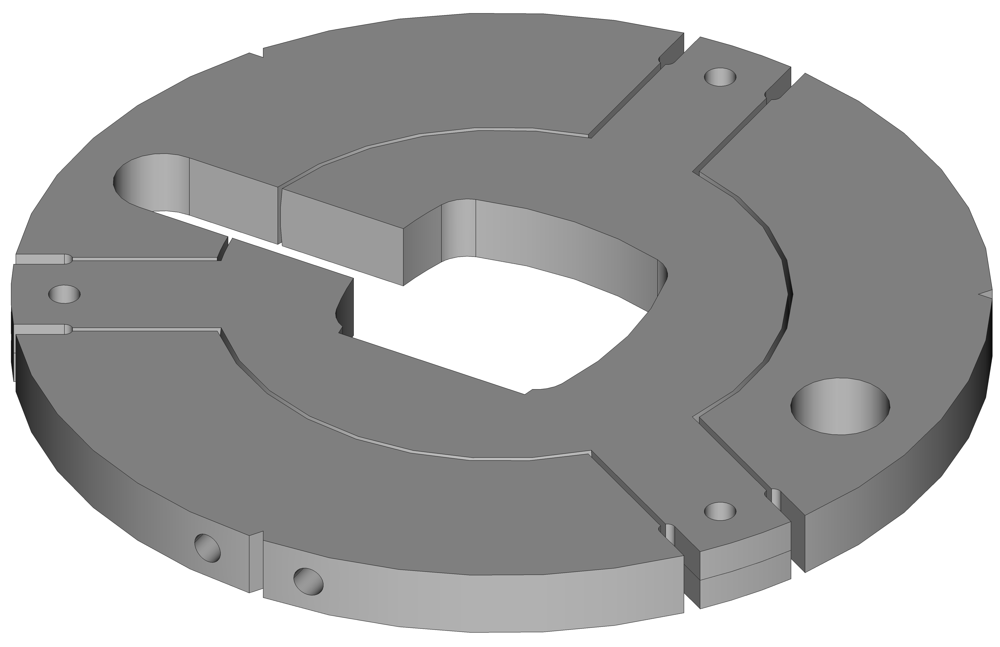
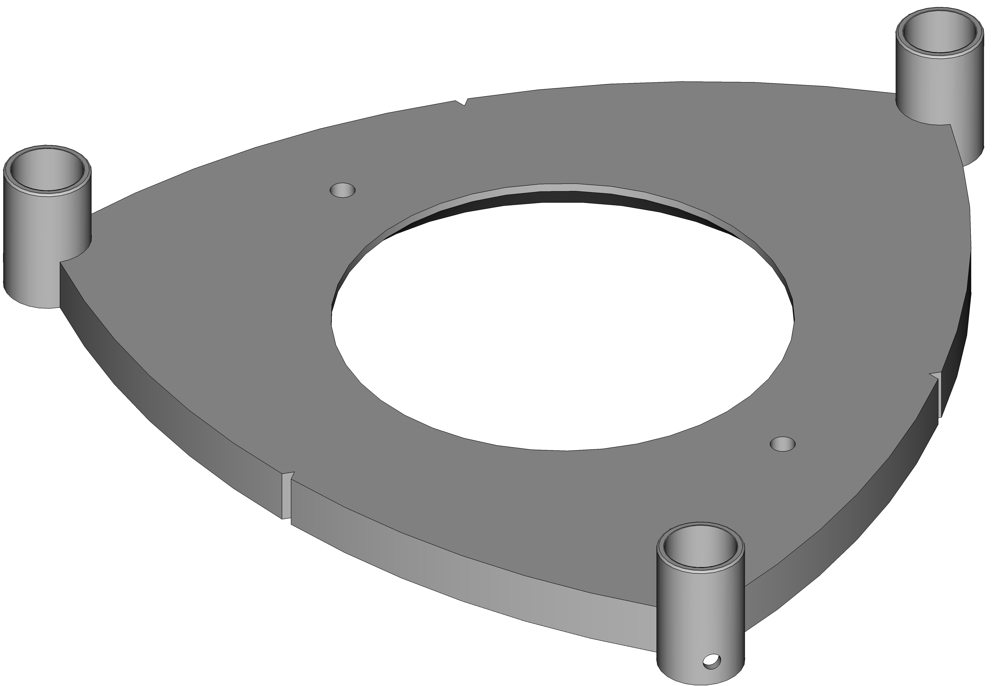

# coldStageDesign
Design files for the cold stage instrument

The repository contains FreeCAD files and .stl files for the cold stage. FreeCAD files can be modified to suit user's preferences while .stl files are helpful to quickly print the designs.

### Cold Stage Controller Box

 

Cold Stage Controller 

The temperature controller TC-36-25-RS23 and power supply LCS150US12 are held within the cold stage controller box. It also has banana plug sockets, 3.5 mm audio mount, USB pass through connector and 3 pin rocker switch. 
The base and cover needs to be printed seperately. [stl/Box_1.stl](https://github.com/CIF-Cold-Stage/coldStageDesign/blob/main/stl/Box_1.stl) and [stl/Box_2.stl](https://github.com/CIF-Cold-Stage/coldStageDesign/blob/main/stl/Box_2.stl) are the base and cover files respectively. The FreeCAD file is [freecad/Box.FCStd](https://github.com/CIF-Cold-Stage/coldStageDesign/blob/main/frecad/Box.FCStd)

### Cold Stage Cell

 

Cold Stage Cell and Spacers

Cold stage cell houses the heat sink, TEC element, cold plate and glass cover. Thermal paste needs to be applied to heat sink, TEC element and cold plate. There are two small holes in the cell to insert thermistor cable that connects to the cold plate. Nitrogen is supplied through one of the openings to prevent condensation.
Cold stage cell needs spacers to hold TEC element and cold plate together.

The cell prints as a single design located at [stl/Body.stl](https://github.com/CIF-Cold-Stage/coldStageDesign/blob/main/stl/Body.stl). The FreeCAD file is [freecad/Body.FCStd](https://github.com/CIF-Cold-Stage/coldStageDesign/blob/main/freecad/Body.FCStd). Spacer files are [stl/Spacer.stl](https://github.com/CIF-Cold-Stage/coldStageDesign/blob/main/stl/Spacer.stl) and [freecad/Spacer.FCStd](https://github.com/CIF-Cold-Stage/coldStageDesign/blob/main/freecad/Spacer.FCStd)

### Cold Stage Stand

The stand has six different design files that can be easily assembled after printing. Stand can be assembled using 15 mm outer diameter - 25 mm length aluminum tube and screws.

   

Stand Base and Supplements

The base houses the cold stage cell. The base requires two supplement parts. 
Base files are [stl/Stand_Part1.stl](https://github.com/CIF-Cold-Stage/coldStageDesign/blob/main/stl/Stand_Part1.stl) and [freecad/Stand/Stand_Part1.FCStd](https://github.com/CIF-Cold-Stage/coldStageDesign/blob/main/freecad/Stand/Stand_Part1.FCStd).
All supplement parts can be printed using [stl/small_parts.stl](https://github.com/CIF-Cold-Stage/coldStageDesign/blob/main/stl/small_parts.stl) while FreeCAD files are stored as [freecad/Stand/Stand_Part1_S1.FCStd](https://github.com/CIF-Cold-Stage/coldStageDesign/blob/main/freecad/Stand/Stand_Part1_S1.FCStd) and [freecad/Stand/Stand_Part1_S2.FCStd](https://github.com/CIF-Cold-Stage/coldStageDesign/blob/main/freecad/Stand/Stand_Part1_S2.FCStd).

Stand Stabilizer

Stabilizer is used to provide stability to the three aluminum rods holiding the stand.

Stand Top

There are two design files for the stand top. It houses the camera used to capture freeze events on the cold plate.
The parts can be printed using [stl/Stand_Part3_1.stl](https://github.com/CIF-Cold-Stage/coldStageDesign/blob/main/stl/Stand_Part3_1.stl) and [stl/Stand_Part3_2.stl](https://github.com/CIF-Cold-Stage/coldStageDesign/blob/main/stl/Stand_Part3_2.stl) while FreeCAD files are located at [freecad/Stand/Stand_Part3_1.FCStd](https://github.com/CIF-Cold-Stage/coldStageDesign/blob/main/freecad/Stand/Stand_Part3_1.FCStd) and [freecad/Stand/Stand_Part3_2.FCStd](https://github.com/CIF-Cold-Stage/coldStageDesign/blob/main/freecad/Stand/Stand_Part3_2.FCStd).

